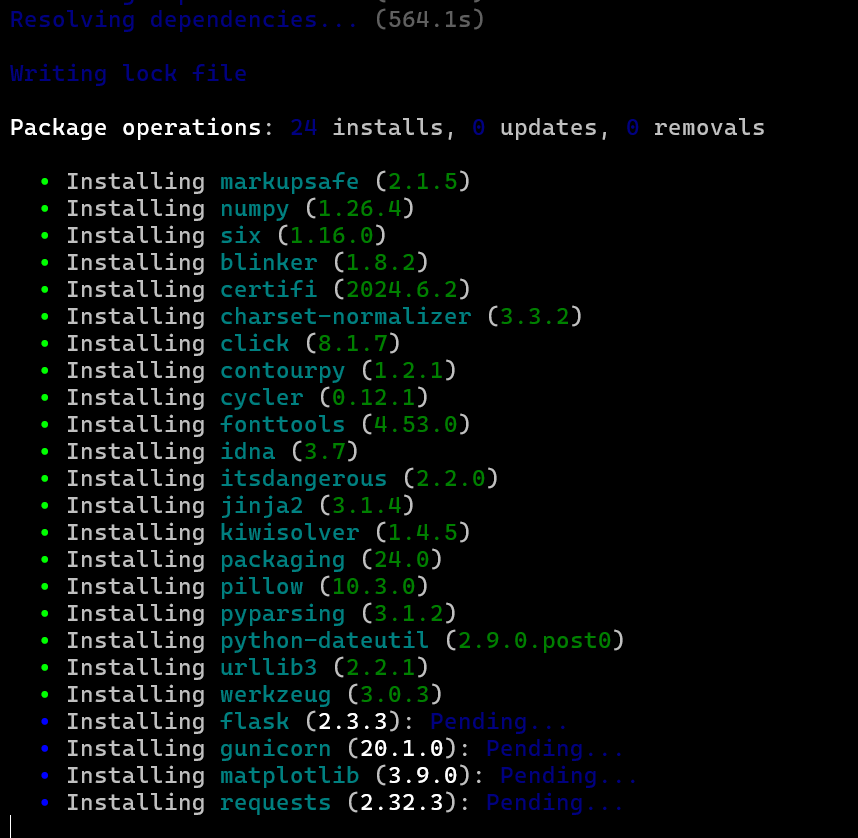

# Handmatige installatie van de SaxCoin REST Backend server

## Aanbevolen requirements:
- **Memory**: 2048MB of meer.
- **CPU**: 2 cores of meer. 1,5Ghz of hoger.
- **Opslag**: 32GB of meer.
- **Firmware type**: Zowel BIOS als UEFI is mogelijk, maar de voorkeur gaat naar UEFI vanwege prestatieverbeteringen en een verhoogde schermresolutie.

## 1. Installeer een nieuwe Ubuntu 22.04 LTS live server in VMware
- Zorg ervoor dat je **NIET** de minimal version gebruikt.
- Momenteel is dit project nog niet compatible met versies hoger dan Ubuntu 22.04 LTS.
- Voeg OpenSSH toe tijdens de installatie. Indien je dit vergeten bent, kan dit later ook nog worden gedaan:
```sh
sudo apt update
sudo apt install openssh-server
```

## 2. Update/ upgrade Ubuntu:
```sh    
    sudo apt update
    sudo apt -y upgrade
```

## 3. Voeg Python installatiemanager Poetry toe:
```sh
sudo apt install -y python3-poetry
```

## 4. Installeer Backend
```sh
git clone https://github.com/THectic-NL/Team-Building-Challenge-24.git
cd 24/Backend
````
En installeer poetry:
````sh
poetry install
````

## 5. Run Backend 
Run in map Backend op port 5000, dan wordt het:
```sh
    poetry run gunicorn app:app --bind 0.0.0.0:5000
```

## Disclaimer en bekende problemen

We gebruiken nog steeds Ubuntu Server 22.04 LTS vanwege de deprecation issues die optreden bij hogere versies. Hogere versies van Ubuntu die Python 3.12 gebruiken zullen problemen veroorzaken vanwege de deprecations in de distutils module.

Het kan even duren om Poetry en alle benodigde pakketten binnen te halen. Dit is afhankelijk van het netwerk. Zie afbeelding hieronder:


Meer informatie hierover is te vinden in de officiële documentatie: 
- [What's New in Python 3.10 - distutils deprecated](https://docs.python.org/3.10/whatsnew/3.10.html#distutils-deprecated)
- [Stack Overflow discussie over deprecation waarschuwing voor distutils](https://stackoverflow.com/questions/72450281/python-3-10-deprecation-warning-for-distutils)

---

Wanneer je tegen problemen aanloopt met de installatie van Poetry en/of Poetry eindeloos bezig is met het resolven van dependencies ("Resolving dependencies..."), voer dan de volgende stappen uit:

### 1. Verwijder oude .lock bestanden
Je moet alle .lock bestanden in de `.cache/pypoetry` directory in je home directory verwijderen.

```bash
find ~/.cache/pypoetry -name '*.lock' -type f -delete
```

### 2. Verwijder oude cache bestanden
Een andere mogelijkheid is een corrupte artifact cache. [Bron](https://github.com/python-poetry/poetry/issues/3352#issuecomment-1369954268)

Je kunt alle virtuele omgevingen verwijderen, de cache wissen en de inhoud van de Poetry artifacts directory verwijderen met de volgende commando's:

```bash
poetry env remove --all
poetry cache clear --all
rm -rf $(poetry config cache-dir)/artifacts
