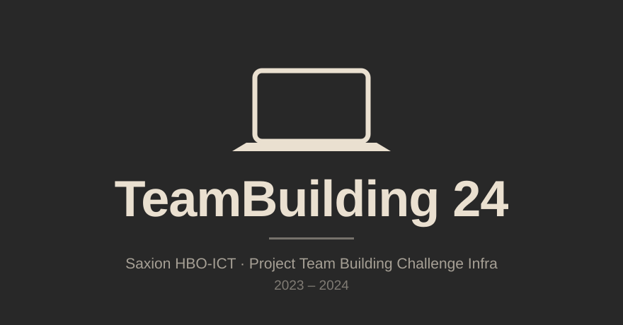
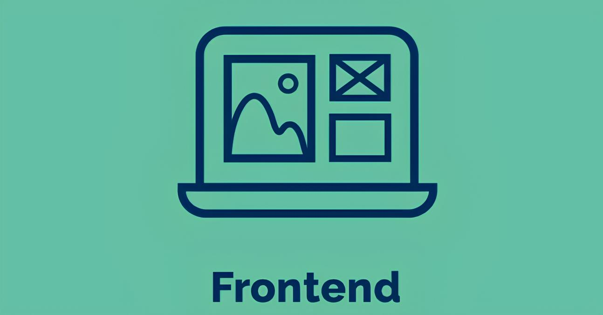
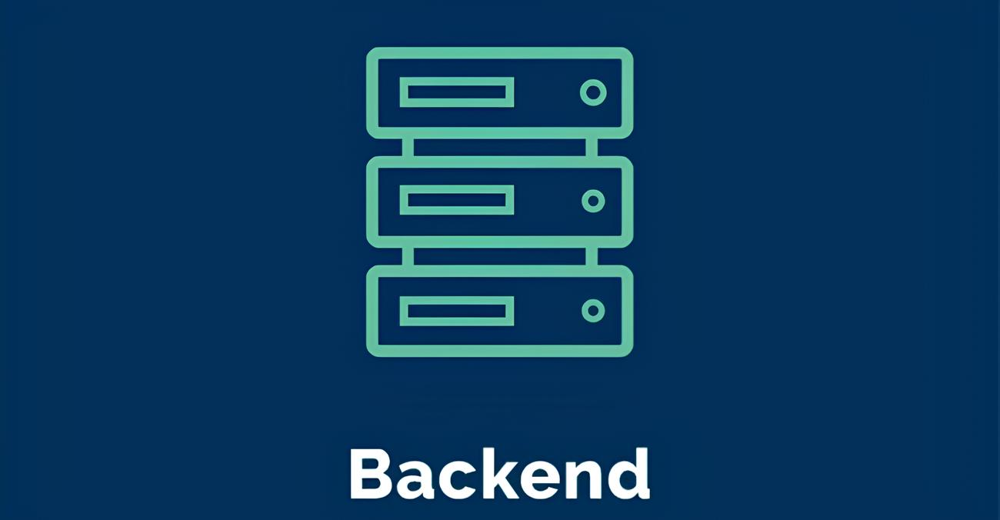

# HBO-ICT Team Building Challenge-24

Welkom bij onze GitLab-repository voor de opdrachten en code van dit kwartiel 1.4 Project Team Building Challenge Infra VT (2023-2024)!

Gea Olde-Schepper, een voormalige Saxion HBO-ICT studente, heeft als afstudeerproject een nieuwe cryptocoin genaamd $ax¢oin ontwikkeld. Samen met Saxion heeft ze een bedrijf opgericht om deze en andere crypto’s verder te ontwikkelen en te verhandelen. Het bedrijf wil een website laten bouwen waar klanten kunnen inloggen, crypto’s kunnen kopen en verkopen, de actuele koersen kunnen volgen en nieuwsberichten kunnen lezen. Een investeerder zal helpen om $ax¢oin bij het grote publiek te introduceren.

Omdat het bedrijf snel groeit en er meerdere ontwikkelaars, testers en beheerders betrokken zijn, is er behoefte aan een OTAP-straat (Ontwikkeling, Testen, Acceptatie en Productie) om de softwareontwikkeling te structureren. Het Saxion Infra-team is gevraagd om een analyse, ontwerp en Proof of Concept (PoC) te maken voor deze ontwikkelstraat. De PoC zal aantonen dat belangrijke requirements voor deze omgeving kunnen worden gebouwd en functioneren. Hiervoor wordt VMware Workstation Pro gebruikt, zodat elk teamlid een fase uit de OTAP-straat op zijn laptop kan draaien.

## Inhoudsopgave
- [Module-Informatie](#module-informatie)
- [Planning / Te behandelen onderdelen/onderwerpen](#planning--te-behandelen-onderdelenonderwerpen)
- [Websites](#websites)
- [Bijdragers](#bijdragers)
- [Credits, Bronnen en gebruikte software](#credits-bronnen-en-gebruikte-software)
- [Veranderingen](#veranderingen)

## Module-Informatie
- **Cursus**: 1.4 Project Team Building Challenge Infra VT (2023-2024)

## Planning / Te behandelen onderdelen/onderwerpen
Hier vind je onze uitwerkingen en de onderwerpen van elke week:

| Week | Sprint  | Onderwerpen                                                        | Deliverables                                                                                                                                  | Contacturen | Studieuren |
|------|---------|--------------------------------------------------------------------|-----------------------------------------------------------------------------------------------------------------------------------------------|-------------|-------------|
| 1    | Sprint 0 | Introductie opdracht, OTAP, documentatie, Scrum basics (PLAN), probleemanalyse, onderzoeksvragen, samenwerken | Plan van Aanpak inclusief probleemanalyse, onderzoeksvragen, werkafspraken, product backlog, sprint 1 backlog en definition of done.          | Les 1: 3 lesuren | 8-12       |
| 2    | Sprint 1 | Git basics (CODE), Scrum basics (PLAN)                             | Sprint backlog, Vooronderzoek, Bijgewerkt CO, TO, Testplan en Testrapport, Bijgewerkte Installatiehandleiding(en) van alle VM's en de ontwikkelde scripts, Sprint retrospective, Demo (voor je team & docent) van het sprint resultaat | Les 1: 3 lesuren, Les 2: 3 lesuren | 8-12 |
| 3    | Sprint 1 | Development omgeving realiseren, testen software cq testplan (TEST), Scrum verdieping |                                                                                                                                                | Les 1: 3 lesuren, Les 2: 3 lesuren | 8-12 |
| 4    | Sprint 2 | DevOps, CI-CD, Gitlab runner (RELEASE)                            | Sprint backlog, Bijgewerkt CO, TO, Testplan en Testrapport, Bijgewerkte Installatiehandleiding(en) van alle VM's en de ontwikkelde scripts, Sprint retrospective, Demo (voor je team & docent) van het sprint resultaat | Les 1: 3 lesuren, Les 2: 3 lesuren | 8-12 |
| 5    | Sprint 2 | Loadbalancing                                                     |                                                                                                                                                | Les 1: 3 lesuren, Les 2: 3 lesuren | 8-12 |
| 6    | Sprint 3 | Security                                                          | Plan van Aanpak en probleemanalyse, Vooronderzoek, Definition of Done, CO, TO, Testplan en testrapport, Sprint retrospectives en backlogs (screenshots?) (3x), Project download (zip) van Gitlab, Filmpje van een demo van het werkende systeem | Les 1: 3 lesuren, Les 2: 3 lesuren | 8-12 |
| 7    | Sprint 3 | Realisatie OTAP, Testrapportage, Einddemo (DEPLOY)                |                                                                                                                                                | Les 1: 3 lesuren, Les 2: 3 lesuren | 8-12 |
| 8    | Assessment | Voorbereiden assessment                                          |                                                                                                                                                | 1             | 4          |

---

 

## Websites
- **saxcoin-b6.nl** _(offline)_: De officiële website voor informatie en updates over $ax¢oin.
- **saxcoin-b6.online** _(offline)_: Platform voor het verhandelen van $ax¢oin en andere crypto's, inclusief actuele koersen.

## Bijdragers
- **S.T.** — Productie ([Stensel8](https://github.com/Stensel8))
- **Y.S.** — Acceptatie
- **P.T.** — Ontwikkeling

## Credits, Bronnen en gebruikte software
Een dikke shoutout naar de volgende bronnen en partijen voor het mogelijk maken van dit project:
- [Cryptologos.cc](https://cryptologos.cc/): Voor het aanleveren en gratis ter beschikking stellen van vector- en mooie, transparante PNG-logo's om te gebruiken voor op onze website.
- [Cloudflare](https://cloudflare.com/): Voor monitoring, beveiliging, tunneling en proxies.
- [CryptoDataDownload](https://www.cryptodatadownload.com/): Voor statische, historische CSV-data.
- [CoinAPI](https://www.coinapi.io/): Voor API-data.
- [GitLab](https://gitlab.com/): Voor de runners en het hosten van het project.
- [Python](https://www.python.org/): Als programmeertaal.
- [VMware Workstation Pro 17.5.2](https://www.vmware.com/products/workstation-pro.html): Voor virtualisatie-oplossingen.
- [Ubuntu](https://ubuntu.com/): Voor de fijne server 22.04 distro.
- Alle docenten van Saxion Hogeschool Enschede: Voor het meedenken, helpen, fixen van bugs en aanleveren van templates en begincode.

## Veranderingen
Een teamlid (J.W.) heeft ons verlaten, en daardoor hebben we nu geen OTAP-straat meer, maar een OAP-straat. De rolverdeling is als volgt:
- **P.T.** - Ontwikkelaar
- **Y.S.** - Accepteerder
- **S.T.** - Productie
